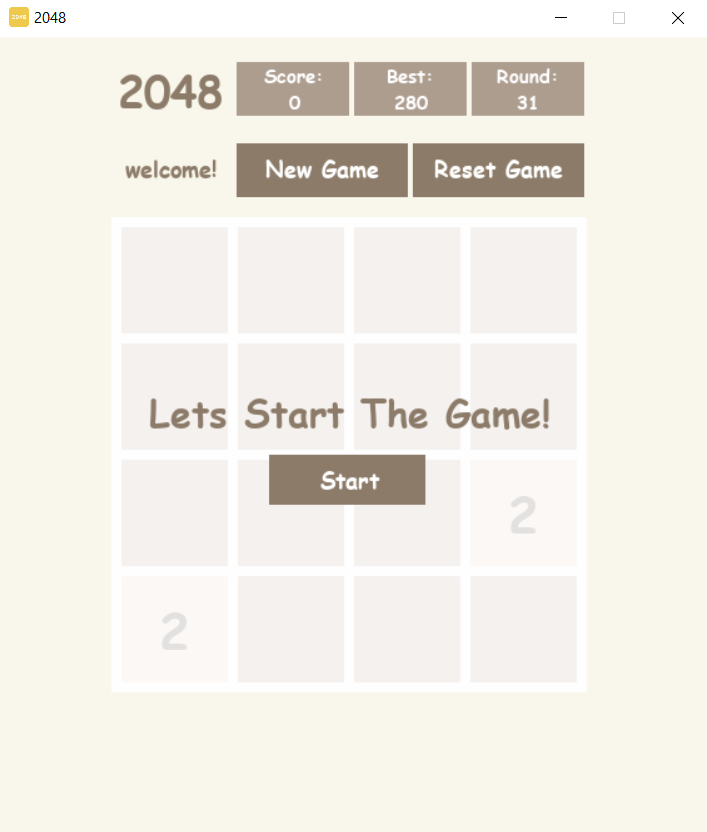
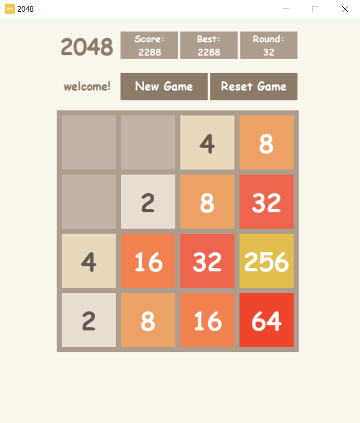
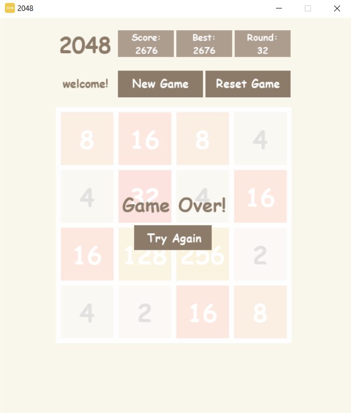

---

# Python 2048 Game

This Python implemention of the classic 2048 game using the Pygame library.

## Installation

To run the game, you need Python and Pygame installed on your system. If you haven't installed Pygame yet, you can do so using pip:

```
pip install pygame
```

Clone this repository to your local machine and navigate to the directory containing the script file(`.json`).

## Usage

Run the game using Python:

```
python 2048.py
```

Once the game starts, you can use the arrow keys to move the tiles on the board. Merge tiles with the same number to reach the 2048 tile and win the game.

## Features

- **GUI**: Utilizes Pygame for graphical user interface.
- **Score Management**: Tracks and displays the current score, best score, and number of rounds played.
- **Menu**: Provides options to start a new game or reset the current game.
- **Tile Generation**: Randomly generates new tiles (2 or 4) on the board after each move.
- **Game Over Detection**: Detects when the game is over by checking for available moves and a full board.

## File Structure

- `2048.py`: Main Python script containing the game logic.
- `images/`: Directory containing images used in the game.
  - `2048_logo.png`: Icon for the game.
  - `start_menu.png`: Image of the start menu.
  - `game.png`: Image of the game screen.
  - `game_over_menu.png`: Image of the game over menu.
- `2048.json`: JSON file used to store and load high scores and the number of rounds played.

## Buttons

The game interface includes four buttons:

- `Start`: Click this button to start the game. It appears at the beginning of the game and allows you to initiate the gameplay. This button will change the game screen to the gameplay interface, hiding the start menu.

- `Try Again`: This button appears when the game is over, giving you the option to try again. Clicking it resets the game board and allows you to make another attempt to reach the 2048 tile. This button will reset the game board and score, returning you to the start menu to begin a new game round.

- `New Game`: Resets the game board and starts a new game. You can click this button to begin a fresh game round. This button will reset the game board and score, allowing you to start a new game session without ending the current one.

- `Reset Game`: Resets the current game session, clearing the board and resetting the score. Use this button if you want to start over without ending the current session. This button will reset the game board and score, allowing you to continue playing without starting a new game session.

These buttons provide convenient controls for managing your game experience and starting new rounds whenever you're ready.

## Screenshots

<table style="border: none; width: 100%;">
  <tr>
    <td>
      <h3>Start Menu</h3>
      
    </td>
    <td>
      <h3>Game</h3>
      
    </td>
    <td>
      <h3>Game Over Menu</h3>
      
    </td>
  </tr>
</table>


## Contributors

- [Mohammadk202](https://github.com/Mohammadk202)

## License

This project is licensed under the MIT License - see the [LICENSE](LICENSE) file for details.

---
